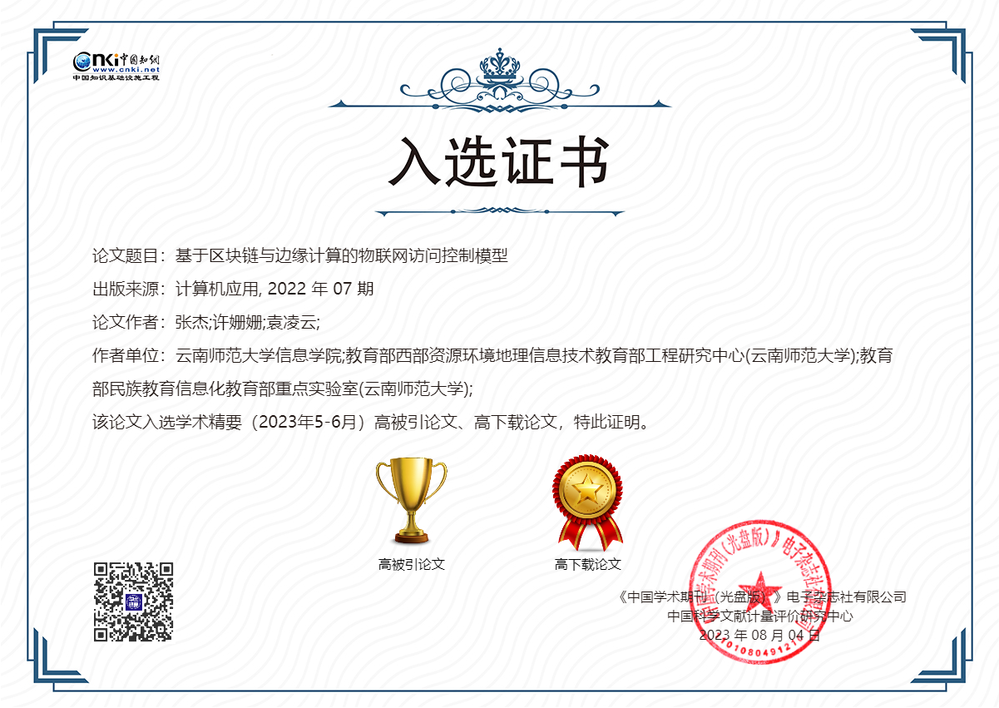

**[04/08/23]** Our paper [Internet of things access control model based on blockchain and edge computing](publication/journal-article/2022/joca-zhang/JOCA-Zhang.pdf) has been selected as a China Knowledge Network Academic Essentials **Highly Cited Paper** and **Highly Downloaded Paper**. 

**Congratulations!**

